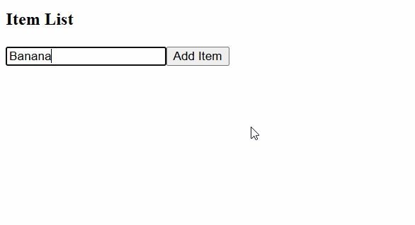

# Item List Manager

lista simples onde o usuário digita um item, clica em "Add Item" e ele aparece na lista.

**HackerRank:** accepted ✅

## Preview

---

## Concepts practiced

**State**
- dois `useState` separados — um pro array de items (`string[]`) e um pro valor do input (`string`)
- usei o padrão de updater function (`setItems(prev => ...)`) pra adicionar o novo item sem perder os anteriores via spread: `[...prev, input]`
- depois de adicionar, resetei o input com `setInput("")`

**TypeScript**
- tipei o state do array como `string[]` e o do input como `string`

**Controlled input**
- o input é controlado: `value={input}` + `onChange={(e) => setInput(e.target.value)}` — o React é a fonte da verdade, não o DOM

---

## Notes

- a validação `if(input.length > 0)` evita adicionar itens vazios
- usei `key={index}` no `.map()` — funciona aqui, mas em listas onde os itens podem ser reordenados ou removidos o ideal seria um id único