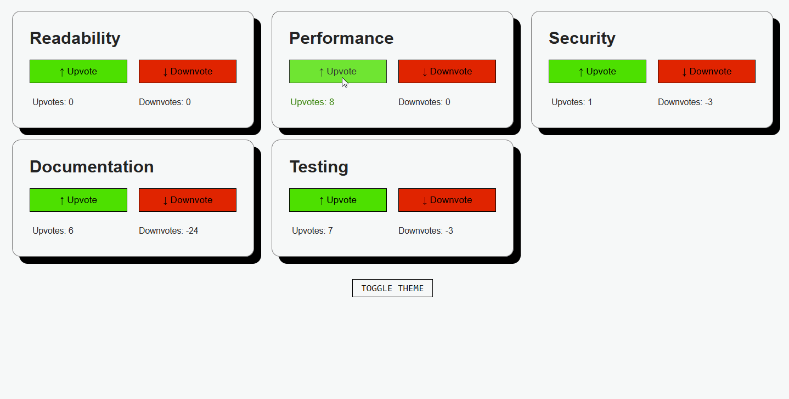

# Code Review Feedback

```
/src/main.tsx

import App from './exercises/2_code-review-feedback/App.tsx'
```

Voting system for 5 code quality aspects: readability, performance, security, documentation, and testing.

**HackerRank:** accepted ✅

## Preview



---

## Concepts practiced
 
**State**
- usei `useState` com um array de objetos — cada aspecto guarda seus próprios contadores de `upvote` e `downvote`
- usei o padrão de updater function (`setAspects(prev => ...)`) pra não pegar state desatualizado
- atualização imutável via spread: `{ ...item, upvote: item.upvote + 1 }`

**TypeScript**
- `interface AspectCard` pra tipar cada item do array de state
- transient props (`$type`) no Styled Components pra não passar atributos não-HTML pro DOM
    - quando você passa uma prop para um Styled Component, o React tenta passar essa prop pro elemento HTML por baixo também
    - `$` = "usa essa prop só no CSS, não manda pro DOM"

**Styled Components**
- CSS variables via `createGlobalStyle` com `:root` e `[data-theme="dark"]` — troca de tema sem context nem biblioteca
    - outra forma de fazer tema dark/light em React é com `useContext`
    - ex. de biblioteca: `ThemeProvider` do próprio Styled Components
- `useEffect` + `document.body.setAttribute` pra aplicar o tema dark
- props dinâmicas em `Button` e `VoteText` pra mudar as cores de acordo com o tipo de voto
- CSS Grid com `grid-template-areas` pro layout dos cards
- `subgrid` no container dos textos de voto pra herdar as colunas do pai
- animação (`@keyframes pop`) disparada por mudança de `key` — re-monta o elemento a cada voto pra repetir a animação
---
 
## Notes
 
- o React Strict Mode roda efeitos e atualizações de state duas vezes em dev — se eu mutasse o objeto diretamente dentro do `setAspects` ia dar bug; o spread resolve isso
    - como eu estava fazendo antes, quando Strict Mode pegou o erro (mutando o objeto original):
        ```
        return { ...item, upvote: item.upvote+=1};
        ```
- o truque de repetir a animação mudando a `key` é uma alternativa simples ao `animation.play()`
    - `animation.play()`: API nativa do browser pra controlar animações CSS via JavaScript
    - com `key`: mudar a key força o React a desmontar e remontar o elemento, o que reinicia a animação automaticamente